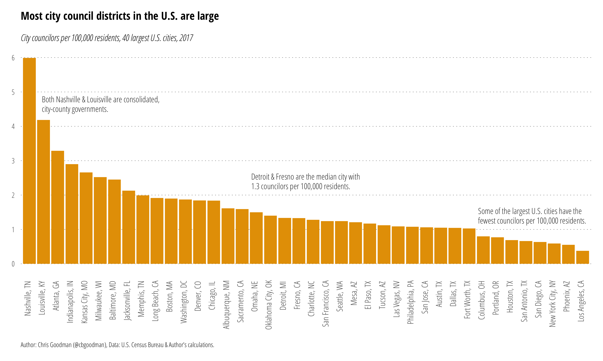

# City Councilors per 100,000 Residents

## U.S.
The **R** script `citycouncil.r` reads `citycouncil.csv` to create the image below of city council members per 100,000 residents for the 40 largest U.S. cities in 2017. Population data is from the 2017 U.S. Census Bureau population estimates and council data are collected by [me](http://www.github.com/cbgoodman) from city council websites.

## Canada
The **R** script `canadiancitycouncil.r` read `canadiancitycouncil.csv` to create the image below of city council members per 100,000 residents for the 40 largest Canadian cities in 2016. Population data from Statistics Canada and city council data are collected by me from city council websites.

